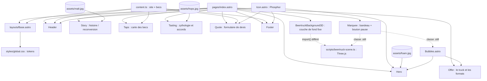
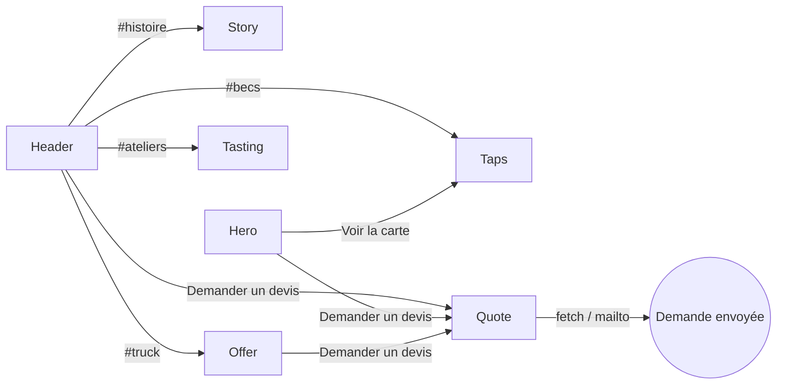

# BrewTruck : architecture et direction artistique

Site vitrine one-page, statique, construit avec Astro. Pas de framework côté client : quelques
scripts courts (formulaire, menu, pause) et un fond 3D Three.js chargé en différé.

## Graphe des composants

Règles :

- **Une seule source de contenu modifiable** : `src/content.ts` (coordonnées, carte des becs).
  Le reste du texte vit dans le composant qui l'affiche.
- **Une seule source de style** : `src/styles/global.css` porte les tokens (couleurs, rayons, typo).
  Chaque composant n'a que du CSS scopé qui consomme ces tokens.
- **Aucun framework JS**. Les animations sont en CSS (scroll-driven quand dispo), le menu mobile
  utilise l'API native `popover`, le formulaire fonctionne sans JS (mailto) et s'améliore avec.
- **Une seule exception lourde : Three.js**, pour le fond 3D. Chargé par `import()` après l'événement
  `load` et au repos du navigateur, jamais sur connexion économe (`saveData`). Sans WebGL, le site
  reste identique. La boucle de rendu s'arrête quand l'onglet est caché ou que le bouton pause est actif ;
  en mouvement réduit, une seule image fixe est rendue.

## Flux de navigation

Une seule intention de conversion sur la page : **Demander un devis** (même libellé partout).

## Direction artistique

**Lecture du brief** : vitrine événementielle premium-artisanale, pour des particuliers (mariages)
et des entreprises, langage organique et contemporain, famille éditoriale sombre.

Réglages : variance 7, mouvement 5, densité 3.

### Palette « Stout & Ambre »

Le thème suit `prefers-color-scheme`. Sombre = une stout ; clair = une blonde sous sa mousse.

| Token | Sombre (stout) | Clair (blonde) | Rôle |
|---|---|---|---|
| `--bg` | `#121310` | `#F3F2EC` | fond, noir de stout à sous-ton houblon |
| `--surface` | `#1C1D18` | `#E7E6DC` | tuiles, champs |
| `--line` | `#34352C` | `#CFCDBF` | filets |
| `--text` | `#ECEBE4` | `#17180F` | texte, « mousse » |
| `--muted` | `#A9A694` | `#595948` | texte secondaire, « céréale » |
| `--amber` | `#E3A444` | `#E3A444` | accent unique (boutons, niveau) |
| `--amber-text` | `#E3A444` | `#8A4E0C` | accent en texte (contraste AA) |

Couleurs de robe des bières (blonde, ambrée, brune) : réservées à la carte des becs, où elles
sont une donnée, pas une décoration.

### Typographie

- **Bricolage Grotesque** (variable : graisse, chasse, taille optique) pour les titres.
  Grotesque aux formes légèrement irrégulières : artisanal sans tomber dans le rétro.
  L'emphase se fait par la graisse (300 contre 700) dans la même famille.
- **Hanken Grotesk** (variable) pour le texte courant : humaniste, très lisible.

### Formes

- Boutons et champs de choix : pilule.
- Médias et tuiles : rayon 24px. Champs de saisie : 12px.
- Le visuel du hero est découpé en silhouette de verre (trapèze), il « se remplit » au chargement.

### Mouvement (toujours motivé, désactivé si `prefers-reduced-motion`)

- Hero : le verre se remplit (narration : le service à la pression).
- Jauge verticale de niveau de bière liée au défilement (état : progression dans la page).
- Robes des bières qui montent dans leur verre à l'entrée dans l'écran (narration).
- Apparition douce des blocs (hiérarchie). Retour tactile sur les boutons (feedback).
- Fond 3D : un Citroën HY en beertruck fait l'aller-retour sur une route pavée, à l'heure dorée.
  Il vit dans la bande basse de l'écran (objectif décalé), sous un dégradé qui garde le haut calme,
  et s'estompe à 25 % d'intensité dès qu'on quitte le hero pour lire.
